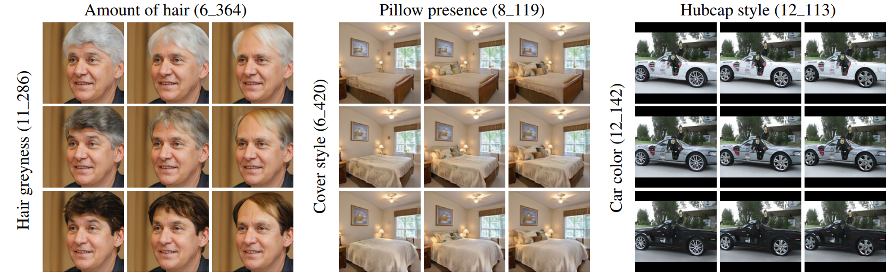
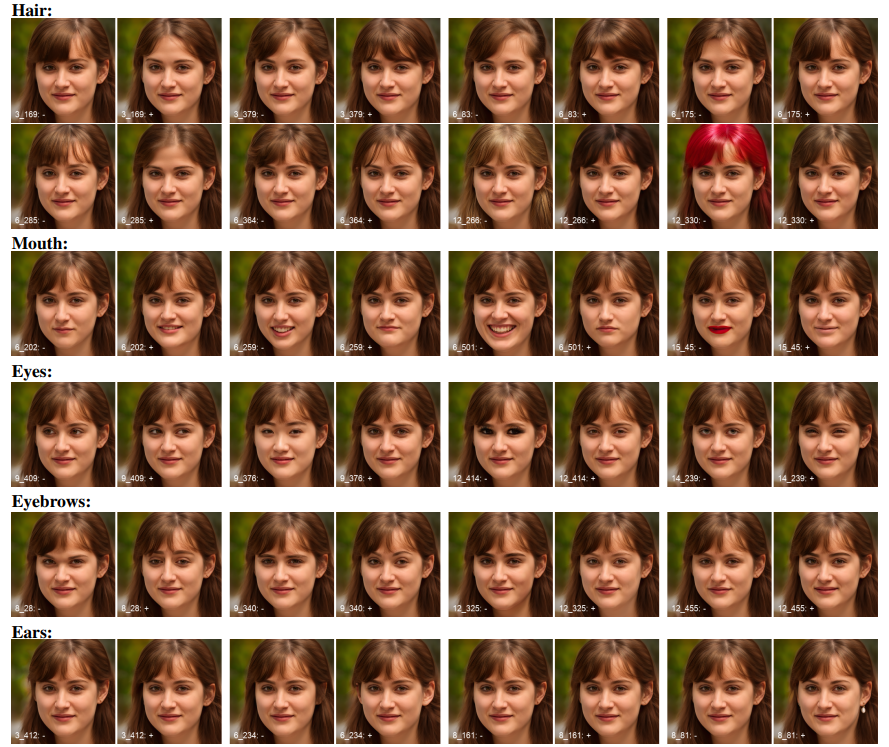
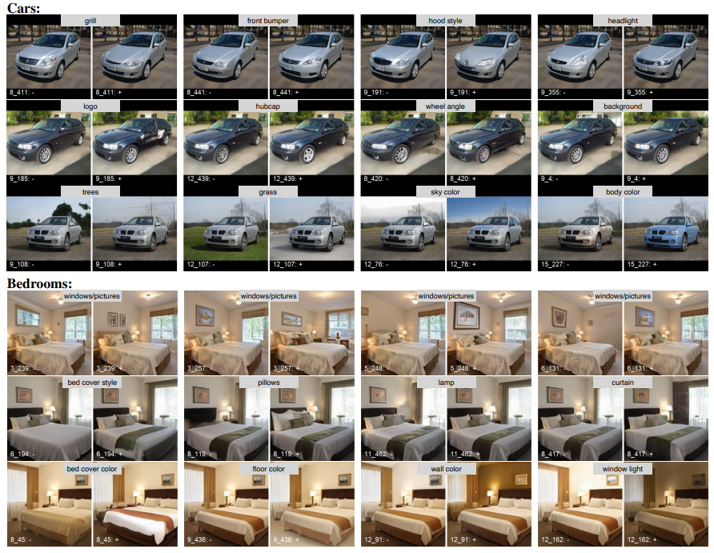
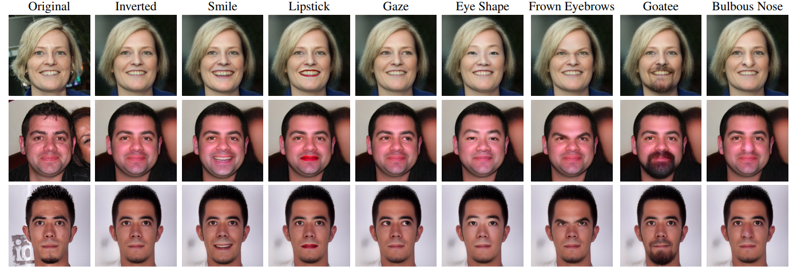

# StyleSpace Analysis: Disentangled Controls for StyleGAN Image Generation (CVPR 2021 Oral) 

> **StyleSpace Analysis: Disentangled Controls for StyleGAN Image Generationy** 
Zongze Wu, Dani Lischinski, Eli Shechtman  
> https://arxiv.org/abs/2011.12799
> [video](https://youtu.be/U7qRotRGr1w)
>
>**Abstract:** We explore and analyze the latent style space of StyleGAN2, a state-of-the-art architecture for image generation, using models pretrained on several different datasets. We first show that StyleSpace, the space of channel-wise style parameters, is significantly more disentangled than the other intermediate latent spaces explored by previous works. Next, we describe a method for discovering a large collection of style channels, each of which is shown to control a distinct visual attribute in a highly localized and disentangled manner. Third, we propose a simple method for identifying style channels that control a specific attribute, using a pretrained classifier or a small number of example images. Manipulation of visual attributes via these StyleSpace controls is shown to be better disentangled than via those proposed in previous works. To show this, we make use of a newly proposed Attribute Dependency metric. Finally, we demonstrate the applicability of StyleSpace controls to the manipulation of real images. Our findings pave the way to semantically meaningful and well-disentangled image manipulations via simple and intuitive interfaces.

#### generated face manipulation

#### generated car and bed manipulation

#### real face manipulation

